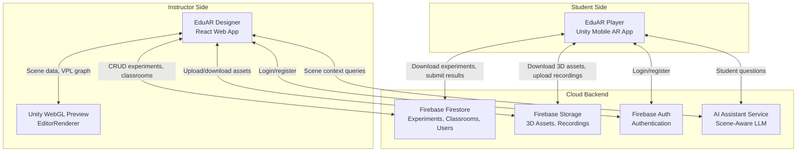
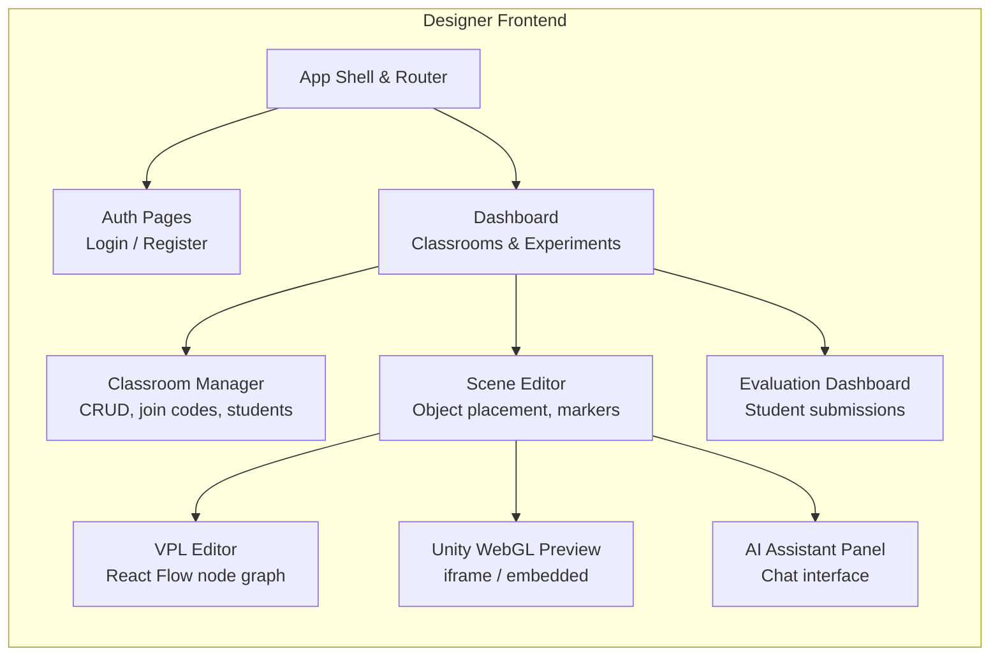
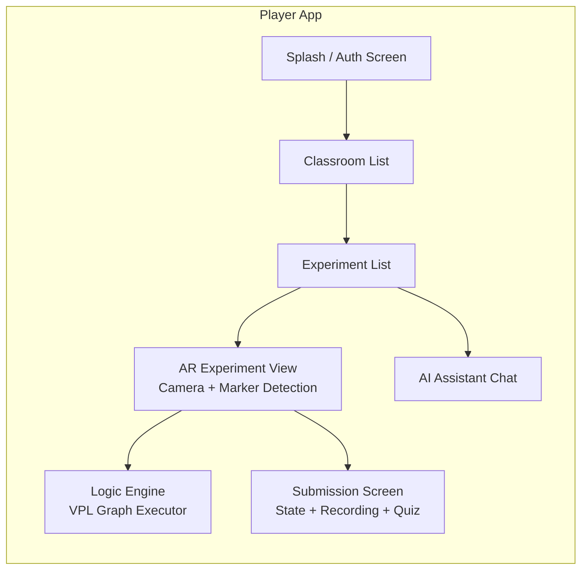

# EduAR — System Architecture Document

> **Version:** 2.0 (Classroom Model)  
> **Date:** March 6, 2026  
> **Platform:** Marker-Based AR (Unity + AR Foundation)

---

## 1. System Overview

EduAR is a two-sided Augmented Reality education platform:

- **EduAR Designer** — A web application where instructors design AR science experiments
- **EduAR Player** — A mobile AR app where students run those experiments
- **Cloud Backend** — Firebase services + AI Assistant API for synchronization and intelligence

The platform now uses a **classroom-based workflow** (similar to Google Classroom) where experiments are organized inside classrooms, enabling structured instructor-student relationships.



---

## 2. Core Entities

### 2.1 Instructor (Teacher)

| Capability | Description |
|---|---|
| Create Classrooms | Named containers for grouping students and experiments |
| Manage Students | Generate join codes, approve/remove students |
| Design Experiments | Scene Editor + VPL + Live Preview |
| Publish & Assign | Publish experiments and attach to classrooms |
| Evaluate Submissions | View recordings, grade experiment completions |
| AI Assistant | Scene-aware design help |

### 2.2 Student

| Capability | Description |
|---|---|
| Join Classrooms | Via join code or invite link |
| View Experiments | Browse assigned experiments per classroom |
| Run Experiments | Launch AR experiments with marker detection |
| Submit Results | Submit experiment state, recordings, quiz answers |
| Ask AI | Ask the AI assistant questions about experiments |

### 2.3 AI Assistant

| Capability | Description |
|---|---|
| Scene Context | Reads current scene graph, objects, properties |
| VPL Generation | Generates/modifies Visual Programming Language flows |
| Logic Suggestions | Recommends experiment logic based on objects placed |
| Experiment Analysis | Analyzes experiment configuration for correctness |
| Q&A | Answers instructor/student questions |

---

## 3. Application Architecture

### 3.1 EduAR Designer (Web — React + TypeScript)



**Key Components:**

| Component | Technology | Purpose |
|---|---|---|
| App Shell | React Router | SPA navigation |
| Auth | Firebase Auth | Login, register, session management |
| Scene Editor | Custom React + Three.js | 3D object placement on canvas |
| VPL Editor | React Flow | Drag-and-drop node graph |
| Unity Preview | Unity WebGL (iframe) | Live 3D experiment preview |
| AI Panel | Chat UI + REST API | Scene-aware AI assistant |
| Classroom Manager | React + Firestore SDK | CRUD classrooms, manage students |
| Evaluation Dashboard | React + Firestore SDK | View/grade student submissions |

### 3.2 EduAR Player (Mobile — Unity + C#)



**Key Components:**

| Component | Technology | Purpose |
|---|---|---|
| Auth Screen | Firebase Auth SDK | Student login/register |
| Classroom List | Firebase Firestore SDK | Browse joined classrooms |
| Experiment List | Firebase Firestore SDK | View assigned experiments |
| AR View | AR Foundation + ARCore/ARKit | Marker detection, object rendering |
| Logic Engine | Custom C# | Executes serialized VPL JSON graph |
| Marker Anchor | Vuforia / AR Foundation | Anchors 3D objects to markers |
| Submission | Firebase Firestore + Storage | Uploads experiment state/recordings |
| AI Chat | REST API client | Student-facing AI assistant |

### 3.3 EditorRenderer (Unity WebGL Build)

Embedded inside the Designer as an iframe. Receives scene data from the React app via `postMessage` and renders a live 3D preview.

| Feature | Description |
|---|---|
| Scene Rendering | Renders 3D objects from scene editor data |
| VPL Simulation | Plays experiment logic in preview mode |
| Asset Loading | Loads 3D models from Firebase Storage URLs |
| Bi-directional Comms | React ↔ Unity via postMessage bridge |

---

## 4. Communication Protocols

### 4.1 Designer ↔ EditorRenderer (WebGL)

```
React App                      Unity WebGL (iframe)
   │                                  │
   │──── postMessage(sceneJSON) ─────>│  Scene data (objects, properties)
   │<─── postMessage(previewState) ───│  Preview feedback
   │──── postMessage(playVPL) ───────>│  Trigger VPL simulation
   │<─── postMessage(vplResult) ──────│  Simulation results
```

### 4.2 Designer ↔ Cloud Backend

```
Designer                        Firebase
   │                                │
   │──── Firestore SDK ───────────>│  CRUD: experiments, classrooms, users
   │──── Storage SDK ─────────────>│  Upload: 3D assets, marker images
   │──── Auth SDK ────────────────>│  Authentication, session tokens
   │                                │
   │──── REST API ────────────────>│  AI Assistant Service (external)
```

### 4.3 Player ↔ Cloud Backend

```
Player (Unity)                  Firebase
   │                                │
   │──── Firestore SDK ───────────>│  Read: experiments, classrooms
   │                                │  Write: submissions, join requests
   │──── Storage SDK ─────────────>│  Download: assets, marker images
   │                                │  Upload: recordings, screenshots
   │──── Auth SDK ────────────────>│  Authentication
   │                                │
   │──── REST API ────────────────>│  AI Assistant (student queries)
```

### 4.4 AI Assistant ↔ System

```
AI Assistant API
   │
   │<──── Scene graph JSON ────── Designer
   │<──── VPL graph JSON ──────── Designer
   │<──── Object properties ───── Designer
   │<──── Experiment config ───── Designer / Player
   │
   │───── VPL suggestions ──────> Designer
   │───── Logic explanations ───> Designer / Player
   │───── Design feedback ──────> Designer
```

---

## 5. Technology Stack

| Layer | Technology | Version / Notes |
|---|---|---|
| **Designer Frontend** | React.js + TypeScript | 18.x, CRA |
| **VPL Editor** | React Flow | Node-based graph editor |
| **3D Preview** | Unity WebGL | EditorRenderer build |
| **Player Engine** | Unity 3D LTS | 2022.3+ |
| **AR Framework** | AR Foundation | ARCore (Android) + ARKit (iOS) |
| **Marker Detection** | AR Foundation Image Tracking | Replaces Vuforia |
| **Authentication** | Firebase Auth | Email/password, Google SSO |
| **Database** | Firebase Firestore | NoSQL document DB |
| **File Storage** | Firebase Storage | 3D assets, recordings |
| **AI Assistant** | OpenAI API / Gemini API | GPT-4o or Gemini 2.0 |
| **3D Modeling** | Blender 3D | Asset pipeline |
| **Scripting** | C# (Unity) + TypeScript (React) | |
| **Version Control** | Git + GitHub | |
| **Target Platforms** | Android API 26+ / iOS 14+ | |

---

## 6. Security Model

| Concern | Solution |
|---|---|
| Authentication | Firebase Auth (JWT tokens) |
| Authorization | Firestore Security Rules (role-based) |
| Data Isolation | Users see only their classrooms/experiments |
| API Security | AI Assistant API requires auth token |
| Asset Access | Firebase Storage rules linked to classroom membership |
| Recording Privacy | Only instructor + submitting student can access |
