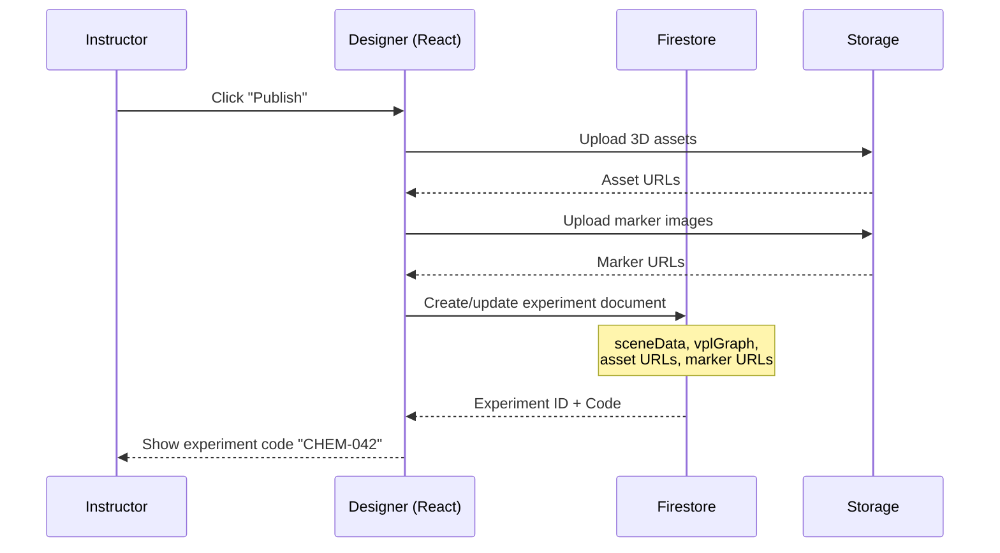
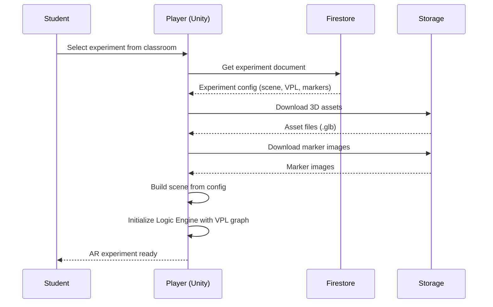
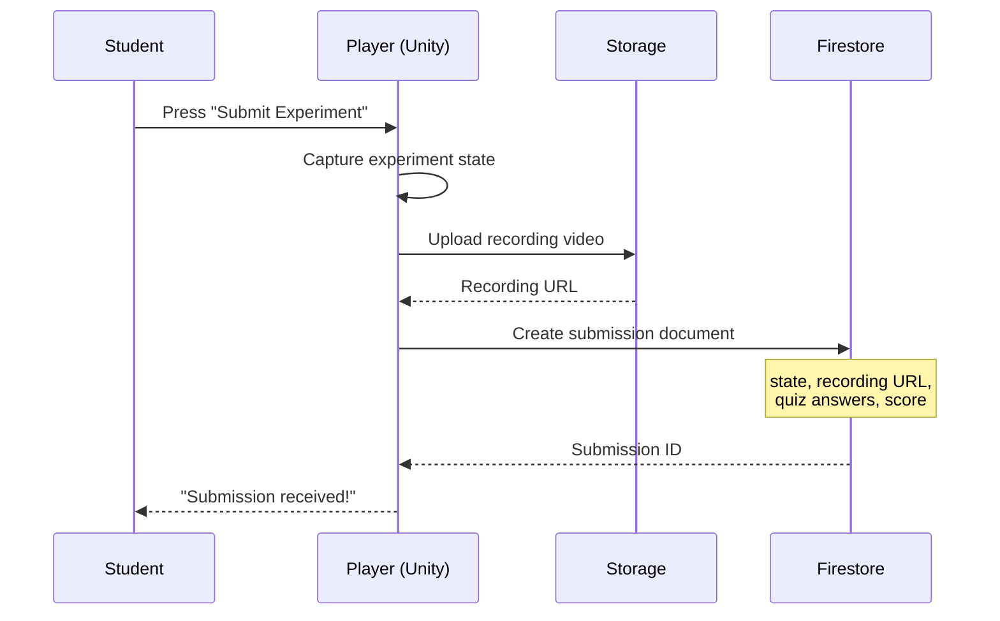

# EduAR — API Structure & Endpoints

> This document defines all API interactions between the Designer/Player clients and the Firebase backend + AI Assistant service.

---

## 1. Firebase SDK Calls (Client-Side)

The Designer (React) and Player (Unity) communicate with Firebase using the client SDKs directly. There is no custom REST API server — Firebase handles authentication, data, and storage.

---

### 1.1 Authentication APIs

| Action | SDK Method | Details |
|---|---|---|
| Register | `createUserWithEmailAndPassword()` | Creates Firebase Auth user + Firestore profile |
| Login | `signInWithEmailAndPassword()` | Returns auth token |
| Google SSO | `signInWithPopup(GoogleAuthProvider)` | Optional social login |
| Logout | `signOut()` | Clears session |
| Get Current User | `onAuthStateChanged()` | Listener for auth state |
| Update Profile | Firestore `updateDoc()` on `users/{uid}` | Name, avatar, institution |

---

### 1.2 Classroom APIs

| Action | Firestore Operation | Collection | Access |
|---|---|---|---|
| Create Classroom | `addDoc("classrooms", data)` | `classrooms` | Instructor only |
| List My Classrooms | `query("classrooms", where("instructorId", "==", uid))` | `classrooms` | Instructor |
| List Joined Classrooms | `query("classrooms", where("classroomId", "in", user.classroomIds))` | `classrooms` | Student |
| Get Classroom | `getDoc("classrooms/{id}")` | `classrooms` | Members |
| Update Classroom | `updateDoc("classrooms/{id}", data)` | `classrooms` | Instructor |
| Delete Classroom | `updateDoc("classrooms/{id}", {archived: true})` | `classrooms` | Instructor |
| Regenerate Join Code | `updateDoc("classrooms/{id}", {joinCode: newCode})` | `classrooms` | Instructor |
| Join Classroom (by code) | Query by `joinCode`, then add member subcollection | `classrooms/{id}/members` | Student |
| Leave Classroom | Delete from `members` subcollection | `classrooms/{id}/members` | Student |
| List Members | `getDocs("classrooms/{id}/members")` | `classrooms/{id}/members` | Instructor |
| Remove Student | `deleteDoc("classrooms/{id}/members/{uid}")` | `classrooms/{id}/members` | Instructor |

---

### 1.3 Experiment APIs

| Action | Firestore Operation | Collection | Access |
|---|---|---|---|
| Create Experiment | `addDoc("experiments", data)` | `experiments` | Instructor |
| List My Experiments | `query("experiments", where("instructorId", "==", uid))` | `experiments` | Instructor |
| Get Experiment | `getDoc("experiments/{id}")` | `experiments` | Members of assigned classrooms |
| Update Experiment | `updateDoc("experiments/{id}", data)` | `experiments` | Instructor (owner) |
| Delete Experiment | `deleteDoc("experiments/{id}")` | `experiments` | Instructor (owner) |
| Publish Experiment | `updateDoc("experiments/{id}", {status: "published"})` | `experiments` | Instructor |
| Assign to Classroom | `updateDoc("experiments/{id}", {classroomIds: arrayUnion(classroomId)})` | `experiments` | Instructor |
| Unassign from Classroom | `updateDoc("experiments/{id}", {classroomIds: arrayRemove(classroomId)})` | `experiments` | Instructor |
| Load by Experiment Code | `query("experiments", where("experimentCode", "==", code))` | `experiments` | Any authenticated user |
| List Classroom Experiments | `query("experiments", where("classroomIds", "array-contains", classroomId))` | `experiments` | Classroom members |

---

### 1.4 Submission APIs

| Action | Firestore Operation | Collection | Access |
|---|---|---|---|
| Submit Experiment | `addDoc("submissions", data)` | `submissions` | Student |
| List My Submissions | `query("submissions", where("studentId", "==", uid))` | `submissions` | Student |
| List Experiment Submissions | `query("submissions", where("experimentId", "==", expId), where("classroomId", "==", clsId))` | `submissions` | Instructor |
| Get Submission | `getDoc("submissions/{id}")` | `submissions` | Student (own) / Instructor |
| Grade Submission | `updateDoc("submissions/{id}", {status, grade, instructorFeedback})` | `submissions` | Instructor |

---

### 1.5 Storage APIs

| Action | Storage Operation | Path | Access |
|---|---|---|---|
| Upload 3D Asset | `uploadBytes(ref("assets/{expId}/{filename}"))` | `assets/` | Instructor |
| Download 3D Asset | `getDownloadURL(ref("assets/{expId}/{filename}"))` | `assets/` | Classroom members |
| Upload Marker Image | `uploadBytes(ref("markers/{expId}/{markerId}.png"))` | `markers/` | Instructor |
| Download Marker Image | `getDownloadURL(ref("markers/{expId}/{markerId}.png"))` | `markers/` | Classroom members |
| Upload Recording | `uploadBytes(ref("recordings/{subId}/{filename}"))` | `recordings/` | Student |
| Download Recording | `getDownloadURL(ref("recordings/{subId}/{filename}"))` | `recordings/` | Student (own) / Instructor |
| Upload Thumbnail | `uploadBytes(ref("thumbnails/{expId}.png"))` | `thumbnails/` | Instructor |

---

## 2. AI Assistant API (REST)

The AI Assistant is an external REST API service (can be a Firebase Cloud Function or standalone server) that provides scene-aware AI assistance.

### Base URL
```
https://eduar-ai.YOUR_DOMAIN/api/v1
```

### Authentication
All requests require Firebase Auth ID token in the `Authorization` header:
```
Authorization: Bearer <firebase-id-token>
```

---

### 2.1 Endpoints

#### `POST /ai/chat`

Send a message to the AI assistant with scene context.

**Request Body:**
```json
{
  "message": "How can I make the beaker change color when two markers are close?",
  "experimentId": "exp_001",
  "sceneContext": {
    "objects": [ /* current scene objects array */ ],
    "vplGraph": { /* current VPL graph */ },
    "markers": [ /* marker assignments */ ]
  },
  "conversationId": "conv_abc",
  "role": "instructor"
}
```

**Response:**
```json
{
  "reply": "You can add a 'Marker Proximity' trigger node connected to a 'Change Color' action node...",
  "suggestedVplNodes": [
    {
      "type": "trigger",
      "subtype": "marker_proximity",
      "config": { "marker1": "marker_01", "marker2": "marker_02", "distance": 0.05 }
    },
    {
      "type": "action",
      "subtype": "change_color",
      "config": { "targetObject": "obj_beaker1", "property": "liquidColor", "value": "#00FF00" }
    }
  ],
  "suggestedEdges": [
    { "source": "suggested_n1", "target": "suggested_n2" }
  ],
  "conversationId": "conv_abc"
}
```

#### `POST /ai/generate-vpl`

Generate a complete VPL graph from a natural language description.

**Request Body:**
```json
{
  "description": "When the student places HCl and NaOH markers close together, pour animation plays, liquid turns green, bubbles appear, and pH changes to 7",
  "sceneContext": {
    "objects": [ /* ... */ ],
    "markers": [ /* ... */ ]
  },
  "experimentId": "exp_001"
}
```

**Response:**
```json
{
  "vplGraph": {
    "nodes": [ /* generated nodes */ ],
    "edges": [ /* generated edges */ ]
  },
  "explanation": "I created a trigger for marker proximity, followed by a sequence of 4 actions..."
}
```

#### `POST /ai/analyze-scene`

Analyze the current scene and provide feedback.

**Request Body:**
```json
{
  "sceneContext": {
    "objects": [ /* ... */ ],
    "vplGraph": { /* ... */ },
    "markers": [ /* ... */ ]
  },
  "experimentId": "exp_001"
}
```

**Response:**
```json
{
  "analysis": {
    "objectCount": 4,
    "connectedLogicPaths": 2,
    "orphanedObjects": ["obj_thermometer1"],
    "suggestions": [
      "The thermometer object has no VPL triggers attached. Consider adding a trigger.",
      "Markers marker_01 and marker_02 have proximity of 3cm which may cause detection issues."
    ],
    "complexity": "intermediate"
  }
}
```

#### `GET /ai/conversation/{conversationId}`

Retrieve conversation history.

---

## 3. Data Flow Diagrams

### 3.1 Experiment Publishing Flow



### 3.2 Student Experiment Loading Flow



### 3.3 Submission Flow


