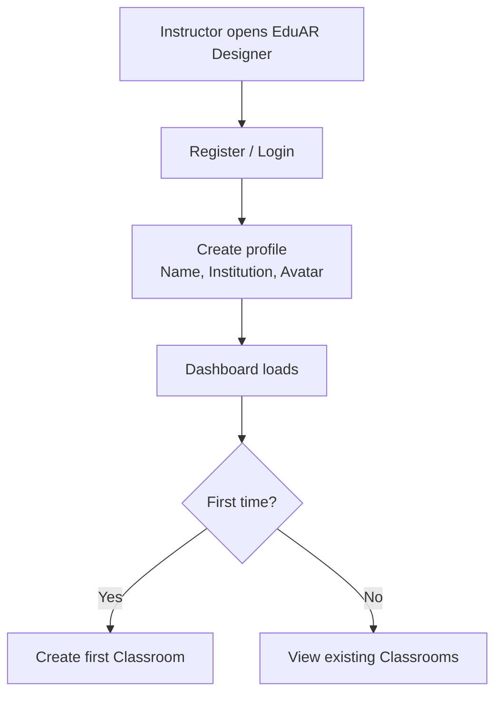
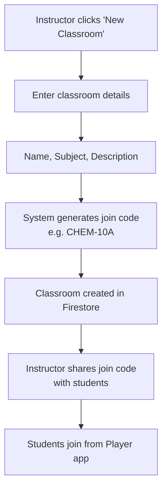
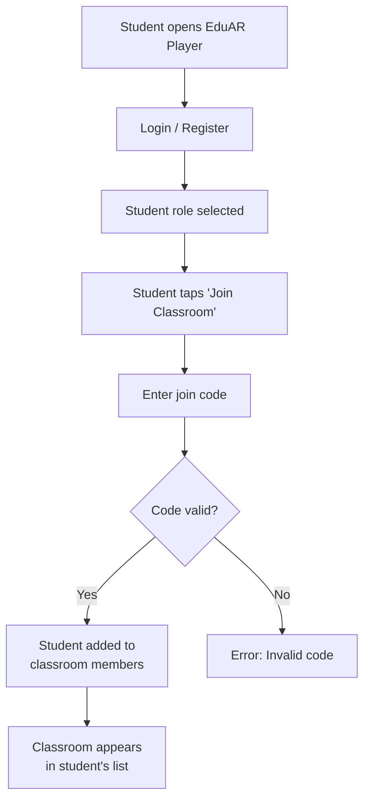
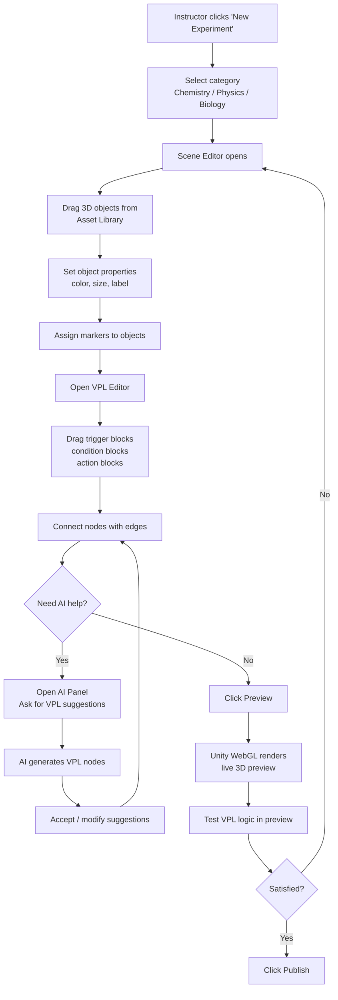
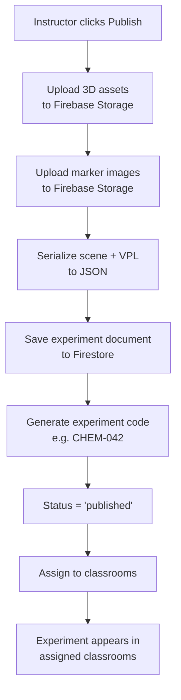
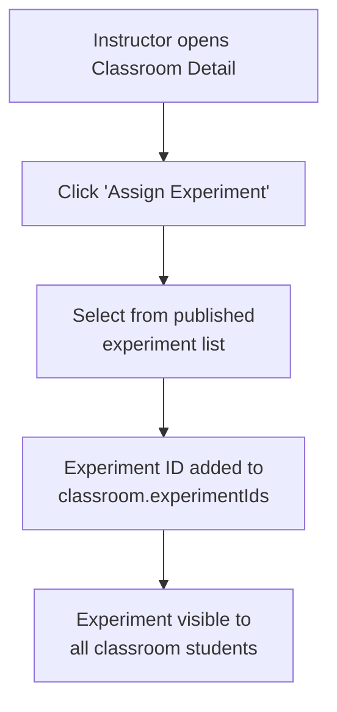
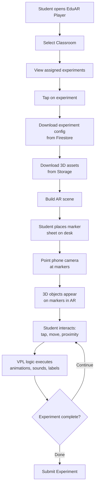
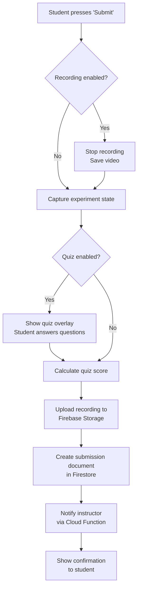
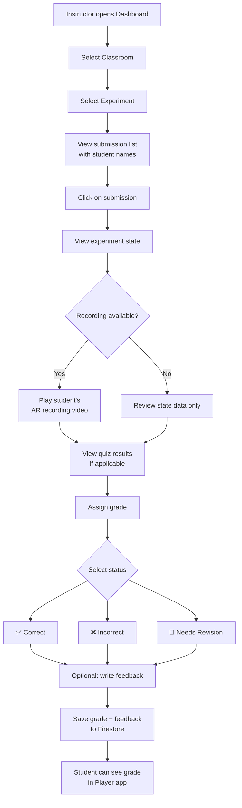
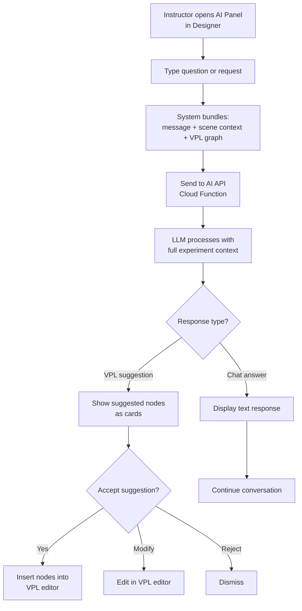

# EduAR — Platform Workflows

> Complete workflow descriptions for all user journeys in the classroom-based EduAR platform.

---

## 1. Instructor Registration & Setup

**Steps:**
1. Instructor opens EduAR Designer web app in browser
2. Registers with email/password or Google SSO
3. Selects role = "Instructor" during registration
4. Fills in profile (name, institution)
5. Arrives at Dashboard showing classrooms and experiments

---

## 2. Classroom Creation Workflow

**Steps:**
1. Instructor clicks **"+ New Classroom"** on dashboard
2. Enters: name, subject, description, optional cover image
3. System generates unique 6-character join code
4. Classroom document created in Firestore
5. Instructor shares the join code with students (verbally, on board, or via messaging)
6. Join code can be regenerated or deactivated at any time

---

## 3. Student Joins Classroom

**Steps:**
1. Student opens EduAR Player on their smartphone
2. Registers or logs in
3. Taps **"Join Classroom"** button
4. Enters the 6-character join code
5. System validates the code against Firestore
6. On success, student is added to `classrooms/{id}/members`
7. Classroom appears in the student's classroom list

---

## 4. Experiment Design Workflow

**Steps:**
1. Instructor clicks **"+ New Experiment"** on dashboard
2. Selects experiment category (Chemistry, Physics, Biology, etc.)
3. **Scene Editor** opens:
   - Drag 3D objects from the Asset Library panel
   - Position objects on the scene canvas
   - Set properties for each object (color, size, label, initial state)
   - Assign each object to a marker ID
4. Switch to **VPL Editor**:
   - Drag blocks from the Node Palette
   - **Blue blocks** = Triggers (marker detected, tap, tilt, proximity, timer)
   - **Yellow blocks** = Conditions (compare value, check state, distance check)
   - **Green blocks** = Actions (animate, color change, show label, play sound, particles)
   - Connect blocks by drawing edges between output and input handles
5. Optionally use **AI Assistant**:
   - Click AI panel icon
   - Describe desired behavior in natural language
   - AI generates VPL node suggestions with edges
   - Accept, modify, or discard suggestions
6. Click **Preview** to see in live Unity WebGL renderer
7. Click **Play** to simulate VPL logic
8. Iterate until satisfied

---

## 5. Experiment Publishing Workflow

**Steps:**
1. Instructor clicks **"Publish"**
2. System uploads all 3D assets to Firebase Storage
3. System uploads marker reference images
4. Scene data + VPL graph serialized to JSON
5. Experiment document created/updated in Firestore with status `published`
6. Unique experiment code generated (e.g., "CHEM-042")
7. Instructor selects which classrooms to assign the experiment to
8. Experiment appears in selected classroom experiment lists

---

## 6. Experiment Assignment Workflow

**Steps:**
1. Instructor opens a classroom detail view
2. Clicks **"Assign Experiment"**
3. Selects one or more published experiments from their list
4. Experiment IDs are added to the classroom's `experimentIds` array
5. Students in that classroom can now see and launch the experiment

---

## 7. Student Experiment Execution Workflow

**Steps:**
1. Student opens EduAR Player
2. Selects a classroom from their list
3. Views experiments assigned to that classroom
4. Taps on an experiment to start
5. App downloads experiment configuration from Firestore
6. App downloads 3D assets from Firebase Storage (cached locally after first download)
7. App builds the AR scene:
   - Creates scene objects
   - Configures marker reference images
   - Initializes VPL Logic Engine
8. Student places the printed marker sheet on their desk
9. Points phone camera at markers
10. 3D objects appear anchored to markers in AR
11. Student interacts: tap markers, move phone, bring markers together
12. VPL logic executes in real-time: animations, color changes, sounds, particle effects, labels
13. Student can repeat interactions unlimited times

---

## 8. Experiment Submission Workflow

**Submission includes:**
- Experiment state snapshot (completed steps, variable values, completion %)
- AR recording video (if recording was enabled)
- Quiz answers and score (if quiz was enabled)

---

## 9. Instructor Evaluation Workflow

**Steps:**
1. Instructor opens the Designer dashboard
2. Selects a classroom
3. Selects an experiment
4. Views list of all student submissions
5. Clicks on a submission to open detail view
6. Reviews:
   - Experiment completion state
   - AR recording video (if available)
   - Quiz answers and score (if enabled)
7. Assigns a status: **Correct**, **Incorrect**, or **Needs Revision**
8. Optionally writes written feedback
9. Saves grade — student can see it in the Player app

---

## 10. AI Assistant Interaction Workflow

**Example Interactions:**
| User Says | AI Does |
|---|---|
| "How do I make the beaker change color?" | Explains trigger → action flow, suggests nodes |
| "Generate logic for acid-base neutralization" | Creates full VPL subgraph with triggers, conditions, actions |
| "What's wrong with my experiment?" | Analyzes scene for orphaned objects, missing triggers |
| "Add a particle effect when markers are close" | Generates MarkerProximity trigger → ParticleEffect action nodes |
