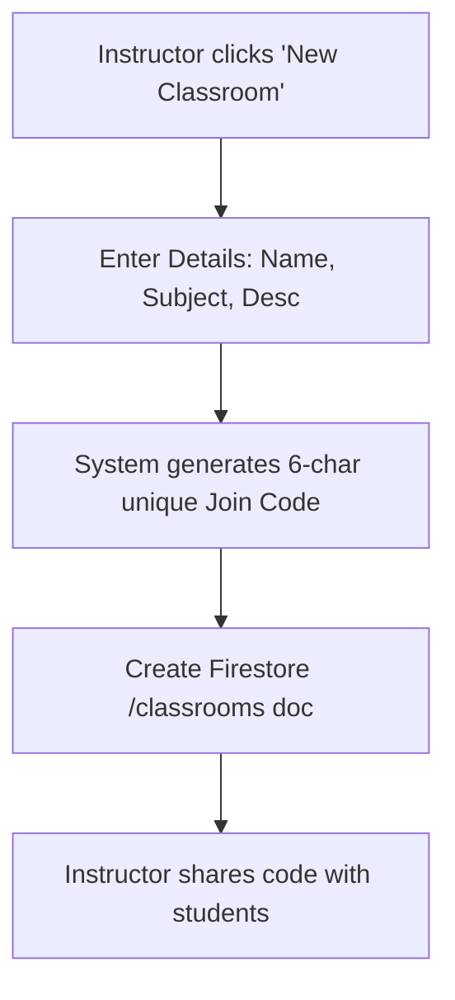
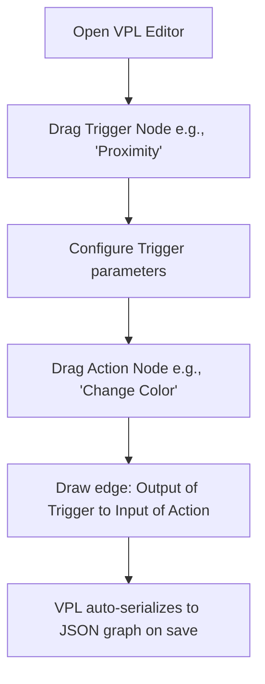
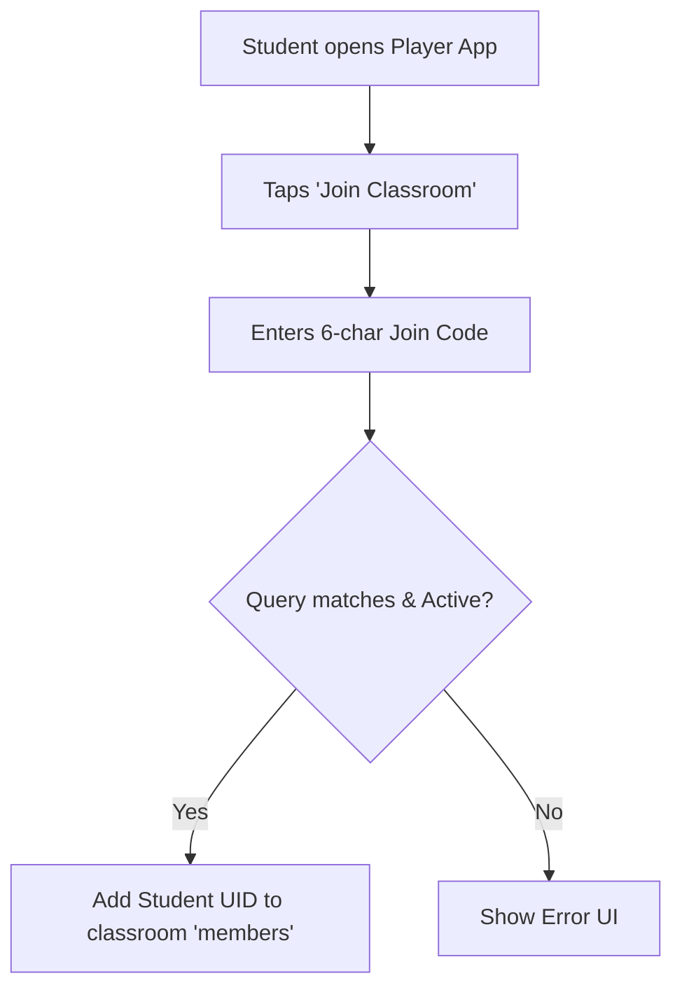
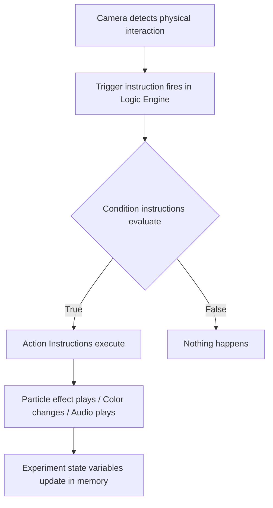
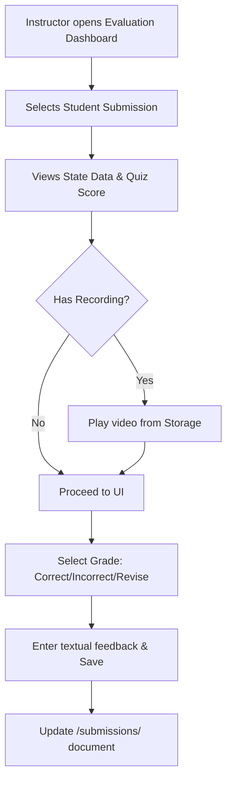

# LucidLab — Comprehensive Platform Workflows

> This document details every workflow in the LucidLab platform, covering the entire lifecycle of Users, Classrooms, Experiments, and Submissions across both the Designer (Web) and Player (Mobile) apps.

---

## 1. Authentication & Account Management

### 1.1 User Registration
**Actor:** Instructor (Web) / Student (Mobile)
1. User opens app and navigates to Register screen.
2. Form requires: Name, Email, Password, Role (Instructor or Student), Institution (Optional).
3. User submits -> Firebase Auth `createUserWithEmailAndPassword`.
4. System creates user profile doc in `/users/{uid}` with provided data.
5. User is redirected to Dashboard (Web) or Classroom List (Mobile).

### 1.2 Login & Password Reset
**Actor:** Instructor / Student
1. **Login:** Enter Email/Password -> `signInWithEmailAndPassword`. Success redirects to main app. Google SSO option maps to `signInWithPopup`.
2. **Reset:** User clicks "Forgot Password" -> enters email -> `sendPasswordResetEmail`. User receives reset link to update password.

### 1.3 Profile Management
**Actor:** Instructor / Student
1. User opens Profile dropdown -> settings.
2. Can update Name, Avatar URL (uploads new image to Storage), and Institution.
3. System updates `/users/{uid}`, reflecting changes across classrooms/submissions.

---

## 2. Classroom Management (Instructor)

### 2.1 Classroom Creation

### 2.2 Editing & Archiving Classrooms
1. **Edit:** Instructor opens Classroom Details -> clicks "Edit". Updates Name/Subject/Cover Image. `updateDoc` saves to Firestore.
2. **Archive/Delete:** Instructor clicks "Archive Classroom". Confirmation dialog. System sets `archived: true` on the classroom document, hiding it from default views but preserving data.

### 2.3 Join Code Management
1. **Regenerate:** If a code leaks, instructor clicks "Regenerate". System generates a new unique code, updating the classroom document. Old code becomes invalid instantly.
2. **Deactivate:** Instructor toggles "Accepting Members" off. Join code remains but `joinCodeActive: false` blocks new queries from succeeding.

### 2.4 Student Roster Management
1. Instructor opens Classroom Detail -> "Students" tab.
2. Views list of all joined students (queried from `/classrooms/{id}/members`).
3. **Remove Student:** Click "Remove" -> confirm. Deletes student from the `members` subcollection and updates `studentCount`.

---

## 3. Experiment Design & Lifecycle (Instructor)

### 3.1 Creating a Draft Experiment
1. Instructor clicks "+ New Experiment".
2. System immediately creates a shell document in `/experiments` with `status: "draft"`.
3. Instructor is routed to Scene Editor to begin work. Auto-save fires periodically.

### 3.2 Scene Design (Object & Property Setup)
1. Drag 3D object from Asset Library onto the 2D layout canvas.
2. Assign logical ID and select properties (color, scale, initial states).
3. Assign physical Marker ID from dropdown to anchor the object in real space.

### 3.3 VPL Logic Design

### 3.4 AI Assistant Interaction
1. Instructor opens AI Chat panel in the Designer.
2. Asks: *"Make Beaker A bubble when tapped."*
3. System sends scene context + VPL state to Cloud Function.
4. AI responds with explanation and `suggestedVplNodes`.
5. Instructor clicks "Accept" -> Nodes are injected into the React Flow canvas.

### 3.5 Experiment Preview (WebGL)
1. Instructor clicks "Preview" tab.
2. React app sends `postMessage` with current Scene JSON + VPL JSON to embedded Unity WebGL build.
3. WebGL renders 3D scene. Instructor clicks "Play" to simulate logic triggers with mouse clicks.

### 3.6 Publishing & Unpublishing
1. **Publish:** Validates scene (no missing markers, intact VPL edges). Uploads used 3D Assets/Thumbnails to Storage. Updates `/experiments/{id}` with `status: "published"` and generates an `experimentCode`.
2. **Unpublish:** Reverts status to `"draft"`. Experiment becomes invisible to students (they cannot launch it, though past submissions remain).

### 3.7 Duplicating & Deleting
1. **Duplicate:** Creates a deep copy of the experiment document with a new ID and title suffix "(Copy)". Reset status to "draft".
2. **Delete:** Hard deletes document. Cloud storage cleanup runs periodically for orphaned assets via Cloud Function.

---

## 4. Classroom-Experiment Operations

### 4.1 Assigning/Unassigning Experiments
1. **Assign:** From Classroom detail, instructor picks from their "Published" experiment list. `experimentId` is added to the classroom's array field, pushing it to students' mobile apps.
2. **Unassign:** Instructor clicks "Remove from Classroom". Modifies array. Students can no longer see the experiment in that classroom view.

---

## 5. Student Classroom Experience

### 5.1 Joining a Classroom

### 5.2 Browsing & Leaving Classrooms
1. Student dashboard queries classrooms where student UID exists in members.
2. Shows cards with instructor name, subject, and available experiments.
3. **Leave:** Student enters classroom settings -> "Leave Classroom". Removes their document from the `members` subcollection.

---

## 6. AR Experiment Execution (Student)

### 6.1 Launching & Asset Download
1. Student selects an assigned experiment.
2. App queries the `/experiments/{id}` document for JSON configuration.
3. App checks local cache. If assets/markers are missing, it downloads them from Firebase Storage with progress bar.

### 6.2 AR Marker Detection & Initialization
1. Phone camera activates using AR Foundation.
2. Vuforia/AR Core scans for specific reference images provided by the experiment config.
3. When identified, Unity instantiates the associated 3D Prefab at the anchor location.
4. Logic Engine `LogicBuilder` parses the VPL JSON and arms initial triggers.

### 6.3 Interactive Execution

### 6.4 Sandbox/Variable Customization (Bonus)
1. If experiment `sandboxMode: true`, Player shows a UI overlay (e.g., Sliders for temperature/resistance).
2. Changing slider dynamically updates the runtime Variable Store inside the Logic Engine, recalculating visual formulas immediately.

### 6.5 Collaborative Execution (Bonus)
1. Multiple students in physical proximity scan the same marker sheet.
2. Their local state syncs simple boolean flags via Firebase Realtime DB presence (e.g., Student A unlocks phase 1 on their phone, allowing Student B to trigger phase 2 on theirs).

---

## 7. Submissions & Evaluation

### 7.1 Student Submission
1. Student presses "Submit Experiment".
2. **Capture:** App serializes runtime `VariableStore` and "steps completed" tracker.
3. **Recording (Optional):** If screen recording was active, the `.mp4` is pushed to Firebase Storage under `/recordings/{submissionId}`.
4. **Quiz (Optional):** App presents multiple-choice AR overlay. Scores are finalized.
5. Create `/submissions/{id}` document capturing state, URL, and score.

### 7.2 Instructor Evaluation

### 7.3 Student Grade Review
1. Student opens Player app and accesses a submitted experiment.
2. The UI shows the submission receipt, and loads any Instructor assigned `grade` and `instructorFeedback` attached to the document.
3. If "Needs Revision", a "Retake Experiment" button is unlocked.
