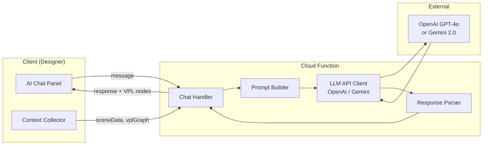

# LucidLab — AI Assistant Integration Specification

> Detailed specification for the scene-aware AI assistant used by instructors (and optionally students) within the LucidLab platform.

---

## 1. Overview

The AI Assistant is a context-aware conversational agent embedded in the LucidLab Designer (and optionally the Player). It understands the current experiment design and helps instructors build Visual Programming Language (VPL) logic through natural language interaction.

---

## 2. Architecture



---

## 3. Context Model

The AI must have access to the following context for every request:

### 3.1 Scene Objects Context

```json
{
  "sceneObjects": [
    {
      "objectId": "obj_beaker1",
      "type": "beaker",
      "label": "HCl (Hydrochloric Acid)",
      "markerId": "marker_01",
      "properties": {
        "liquidColor": "#FF0000",
        "fillLevel": 0.7,
        "position": { "x": 0, "y": 0, "z": 0 }
      }
    },
    {
      "objectId": "obj_beaker2",
      "type": "beaker",
      "label": "NaOH (Sodium Hydroxide)",
      "markerId": "marker_02",
      "properties": {
        "liquidColor": "#0000FF",
        "fillLevel": 0.5
      }
    }
  ]
}
```

### 3.2 VPL Graph Context

```json
{
  "existingVPL": {
    "nodes": [
      { "nodeId": "n1", "type": "trigger", "subtype": "marker_detected", "config": { "markerId": "marker_01" } }
    ],
    "edges": []
  }
}
```

### 3.3 Marker Context

```json
{
  "markers": [
    { "markerId": "marker_01", "label": "HCl Marker", "assignedTo": "obj_beaker1" },
    { "markerId": "marker_02", "label": "NaOH Marker", "assignedTo": "obj_beaker2" }
  ]
}
```

### 3.4 Available Node Types

```json
{
  "availableNodes": {
    "triggers": ["marker_detected", "marker_proximity", "tap", "tilt", "timer"],
    "conditions": ["compare_value", "check_state", "proximity_distance"],
    "actions": ["play_animation", "change_color", "show_label", "play_sound", 
                "particle_effect", "update_display", "spawn_object"]
  }
}
```

---

## 4. System Prompt Template

The LLM receives this system prompt (condensed version):

```
You are the LucidLab AI Assistant, a specialist in augmented reality experiment design.

You help teachers design AR science experiments using the LucidLab Visual Programming Language (VPL).

## Your Context
- You have access to the teacher's current scene objects, their properties, and marker assignments.
- You have access to the current VPL graph (nodes and edges).
- You know all available VPL node types.

## VPL Node Types
TRIGGERS (Blue): marker_detected, marker_proximity, tap, tilt, timer
CONDITIONS (Yellow): compare_value, check_state, proximity_distance
ACTIONS (Green): play_animation, change_color, show_label, play_sound, particle_effect, update_display, spawn_object

## Your Capabilities
1. EXPLAIN: Explain how VPL works, how triggers/conditions/actions connect
2. GENERATE: Create VPL node configurations from natural language descriptions
3. ANALYZE: Review the current scene and VPL graph for issues or improvements
4. SUGGEST: Recommend experiment logic based on placed objects
5. DEBUG: Help fix VPL logic that isn't working as expected

## Response Format
When suggesting VPL nodes, return them in this JSON format within your response:
{
  "suggestedNodes": [...],
  "suggestedEdges": [...]
}

Always explain your suggestions in plain language first, then provide the structured VPL if applicable.
```

---

## 5. Interaction Patterns

### 5.1 Chat Conversation

Standard Q&A about experiment design, VPL concepts, or scientific content.

**Example:**
> **Teacher:** "What's a good way to simulate Ohm's Law?"  
> **AI:** "For Ohm's Law (V = IR), I'd suggest placing a battery, resistor, LED, and ammeter as scene objects, each on separate markers. Then create this VPL flow:
> 1. Trigger: All 4 markers detected simultaneously
> 2. Action: Connect virtual wires between components
> 3. Action: Update ammeter display with I = V/R
> 4. Trigger: Student changes resistance slider
> 5. Action: Recalculate and update ammeter + LED brightness"

### 5.2 VPL Generation

The AI generates complete or partial VPL graphs from natural language.

**Example:**
> **Teacher:** "When HCl and NaOH markers are close, pour the liquid, change color to green, add bubbles, and update pH to 7"

**AI Response includes `suggestedNodes`:**
```json
{
  "suggestedNodes": [
    {
      "type": "trigger", "subtype": "marker_proximity",
      "config": { "marker1": "marker_01", "marker2": "marker_02", "distance": 0.05 }
    },
    {
      "type": "action", "subtype": "play_animation",
      "config": { "targetObject": "obj_beaker1", "animation": "pour" }
    },
    {
      "type": "action", "subtype": "change_color",
      "config": { "targetObject": "obj_beaker2", "property": "liquidColor", "value": "#00FF00", "duration": 2.0 }
    },
    {
      "type": "action", "subtype": "particle_effect",
      "config": { "targetObject": "obj_beaker2", "effect": "bubbles" }
    },
    {
      "type": "action", "subtype": "update_display",
      "config": { "targetObject": "obj_ph_meter", "property": "value", "value": "7" }
    }
  ],
  "suggestedEdges": [
    { "source": 0, "target": 1 },
    { "source": 1, "target": 2 },
    { "source": 2, "target": 3 },
    { "source": 3, "target": 4 }
  ]
}
```

### 5.3 Scene Analysis

The AI analyzes the current scene and provides feedback.

**Example:**
> **Teacher:** "Check my experiment design"  
> **AI:** "I notice a few things:
> 1. ⚠️ The thermometer (`obj_thermo1`) is placed in the scene but has no VPL triggers connected to it. Consider adding an action to update its reading during the reaction.
> 2. ✅ Your marker proximity trigger between `marker_01` and `marker_02` looks correct.
> 3. 💡 Consider adding a completion message after all actions execute, so students know they've finished the experiment."

---

## 6. Student-Side AI (Optional)

A simplified version of the AI assistant can be available in the Player app:

| Feature | Available |
|---|---|
| Ask questions about the experiment | ✅ |
| Get hints during experiment | ✅ |
| Generate VPL (design features) | ❌ |
| Modify experiment | ❌ |

**Student AI Context:**
- Experiment title and description
- Experiment instructions
- Current experiment state
- Quiz questions (for hints, not answers)

---

## 7. Cost & Rate Limiting

| Parameter | Value |
|---|---|
| Model | GPT-4o-mini (default) / GPT-4o (for VPL generation) |
| Max tokens per request | 2000 |
| Rate limit | 20 requests per user per hour |
| Conversation history | Last 10 messages included in context |
| Scene context | Compressed to essential fields only |
| Estimated cost | ~$0.001 per chat, ~$0.01 per VPL generation |
